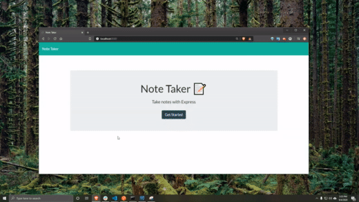

# Note-Taker
## A simple note taking application, users can add save notes, recall save notes and add onto them, or delete old notes. 

# Table of Contents :
      
- [Installation](#installation)
- [Usage](#usage)
- [Contributing](#contribution)
- [Questions](#questions)
## Installation:
N/A 
## Usage:
Anyone can use! 
## Contributing:
N/A   
## Questions
If you have any questions, please feel free to email me at m.bonnev9@gmail.com or take a look at my github page: https://github.com/mbone1 
